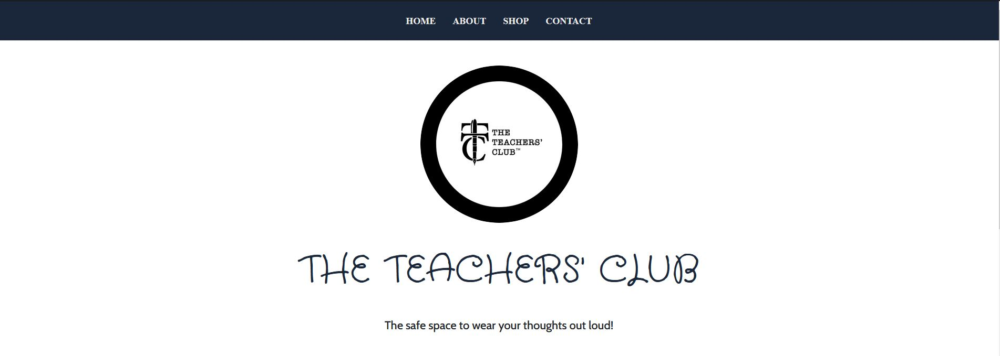

# THE TEACHERS' CLUB REACT SITE

## Re-developed Teachers Club website in React.js. 

### COMPONENTS & PAGES 

The following components are included in the project:
- Navigation Bar
- Carousel
- Images 
- Footer
- Contact Form created using Formik 

The following pages will be routed throughout the website using BrowserRouter, Routes, and Route:
- Homepage
- About page
- Shop page
- Contact page 

## Difference between Bootstrap Project and React.js Project?

These projects differ for various reasons explained below:

- The react.js project features more media queries which creates an extensive responsive design that will appease users on different devices.

- The Bootstrap primarily focused on the use of JavaScript syntax to create the funactionality of the shop page. The react.js project will utilize Redux and the store.js to create most of the shop features such as the cart.js. 

- The useState hooks will be implemented render the images of the products on the page. I will also add the loading and errors component to create the webpage to be able to replicate being a part of the json server. 

## Images of the Different Pages

### HomePage.js

### AboutPage.js

### ContactPage.js 

